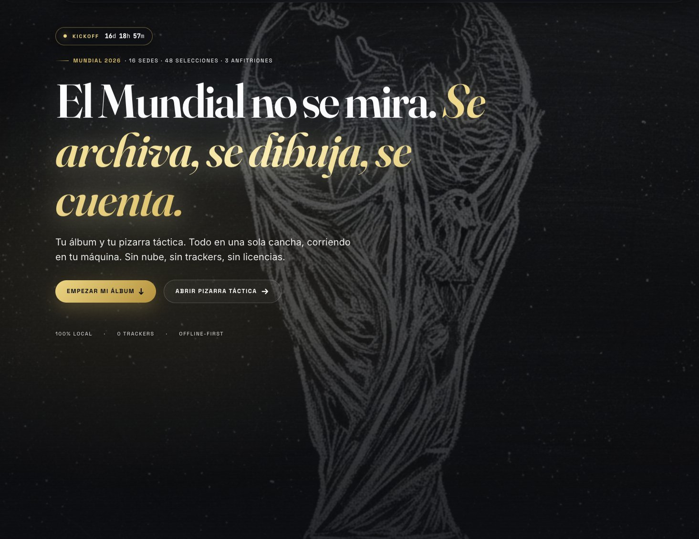
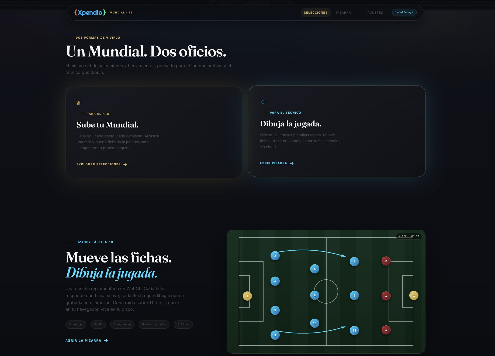
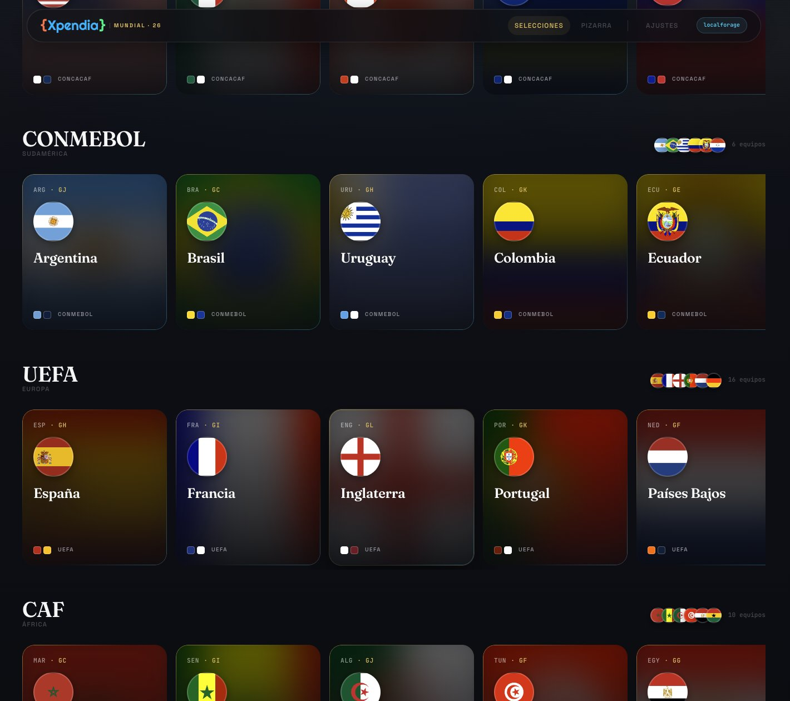
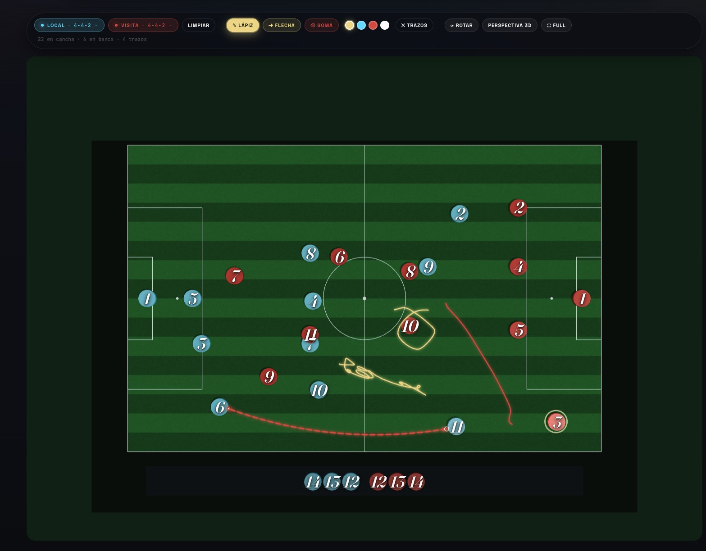

<div align="center">

# Xpendia · World Cup 26

[🇪🇸 Español](./README.md) · **🇬🇧 English**

**Your 2026 World Cup, on your own machine.** A _local-first_ web app to build your personal World Cup archive — collect photos and videos for all 48 teams, draw tactics on a 3D board, and project everything in marquee presentation mode.

[](./LICENSE)
[](https://vitejs.dev/)
[](https://react.dev/)
[](https://www.typescriptlang.org/)
[](https://threejs.org/)
[](https://chakra-ui.com/)
[](#-internationalization)

</div>

---

> **Not affiliated with FIFA or any national federation.** No protected logos included. Flags, factual data and rosters come from public sources with proper attribution. This is an editorial, experimental project — all multimedia content you upload stays on your device.

## What is this?

Xpendia World Cup 26 is a **local-first web app** with three crafts under one roof:

- **For the fan** — a digital album with all 48 teams grouped by confederation and by the 12 official groups. Upload photos and videos straight from your browser; every goal stays pinned to its player, on your disk.
- **For the coach** — a **FIFA-regulation 3D tactical board** (105×68 m) with tokens for both teams, smooth physics-based drag, formation presets per team, and a 2D overlay to draw lines, curved arrows with an aerodynamic feel, and broadcast-style freehand strokes.
- **For presenting** — **Marquee Mode**: a full-screen slideshow with cinematic transitions that projects all of a team's multimedia, with editorial branding and a vectorized chrome trophy background.

Everything runs in your browser. No cloud, no trackers, no licenses.

## Screenshots

<table>
  <tr>
    <td width="50%"></td>
    <td width="50%"></td>
  </tr>
  <tr>
    <td colspan="2" align="center"><sub>Editorial hero · Crafts bento + tactical board showcase</sub></td>
  </tr>
  <tr>
    <td width="50%"></td>
    <td width="50%"></td>
  </tr>
  <tr>
    <td colspan="2" align="center"><sub>Confederations with kit colors · Board with drawing overlay and active tools</sub></td>
  </tr>
</table>

## Features

### 🏆 Editorial landing page

- Hero with the World Cup 2026 trophy at scale and countdown to the kickoff date.
- Two "crafts" in bento tiles: fan and coach.
- `TacticsShowcase` — animated mini-board with two curved arrows showing wing buildup (#2→#7 and #3→#11).
- `GroupsBoard` — the 12 official groups with all 48 teams, color-coded by confederation.
- `FixtureCalendar` — tentative schedule for the 7 phases (104 matches, 39 days).
- `ConfederationGallery` — teams grouped by AFC / CAF / CONCACAF / CONMEBOL / OFC / UEFA in scroll-snap carousels, hosts highlighted.

### 📁 Teams and rosters

- 48 teams with flag, home/away kit, group, confederation and host flag.
- 11 tentative rosters with `name`, `number`, `position`, `club`, `age` or `birthDate` (Argentina, Brazil, Spain, France, England, USA, Mexico, Canada, **plus South Korea, Bosnia and Switzerland imported from Wikipedia**).
- `TeamPage` per team with a _full-bleed_ flag header, kit colors and responsive `PlayerGrid` (2→6 columns).
- `PlayerCard` with a _grayscale-shadow_ effect when no media has been uploaded; once you drop a photo, color and life come back.
- `PlayerDetailModal` with per-player gallery, multi-file drag-and-drop and inline previews. Shows club + age when available.

### ✏️ 3D tactical board

> Route `/tactics`. Built on **react-three-fiber** + **drei** + **zustand**.

- FIFA-scale pitch with procedural grass texture (canvas + deterministic mulberry32 noise) and regulation lines (perimeter, halfway, center circle r=9.15 m, penalty boxes, penalty spots).
- **3D tokens** (low cylinders) with smooth physics drag (damping factor 12), HTML overlay shirt number, gold selection ring, raycasting that respects field rotation (`worldToLocal`).
- **Independent formations** per Home/Away team: 4-4-2, 4-3-3, 4-2-3-1, 3-5-2, 5-3-2, 3-4-3.
- **Glassmorphism TeamMenu**: add to pitch / bench, swap players, pick formation.
- **3D perspective** with OrbitControls vs **top-down** with auto-fit based on rotation and aspect ratio.
- **Camera auto-fit**: when the pitch rotates 90°/180°/270°, the camera recomputes the optimal distance so the pitch fills the canvas in any orientation.
- **Fullscreen button** local to the app (no native Fullscreen API).

### 🎨 Drawing overlay

A 2D canvas layered on top of the 3D scene, synced with rotation and zoom:

- **Pen** with exponential smoothing.
- **Arrow** as a quadratic Bézier with an aerodynamic feel:
  - Tap the **radar blip** at the origin → cycles `convex → flat → concave`.
  - Drag the base → moves the origin.
  - Drag the **tip handle** → re-routes the destination.
  - **Animated marching ants** (RAF + `lineDashOffset`) for flowing motion.
- **Eraser** with point-to-segment hit-testing.
- **Palette** gold / cyan / red / white.
- Strokes follow the pitch when you rotate or zoom.
- Respects `prefers-reduced-motion`.

### 🎬 Marquee Mode

A button in each team's header (`TeamPage`) opens a full-screen-within-app projection (no native Fullscreen API):

- Background: World Cup trophy with **vectorized chrome effect** (SVG filter `feColorMatrix` + `feComponentTransfer` with blue-steel tone curves).
- Cycles through **all media** uploaded for the team's players, shuffled.
- **7 alternating cinematic transitions**: `kenburns`, `crossfade`, `slideR`, `slideL`, `blurpull`, `whippan`, `scaledown`.
- **Empty state with embedded YouTube** + credit to `@JuanPabloZaracho` when the team has no media yet.
- Broadcast HUD: flag + jersey number + player name, `{Xpendia} · Mundial 26` branding, `01/12` counter, cyan→gold progress bar.
- ESC, click outside, or "Exit · Esc" button to close.
- Respects `prefers-reduced-motion`.

### 💾 Storage

Two interchangeable backends via environment variable, both implementing the same `IMediaStorage` (Strategy pattern):

- **LocalForage** (default) — browser IndexedDB. No Docker. Limit ~50 MB–2 GB depending on browser.
- **MinIO** (S3-compatible) — `docker compose up -d`, ideal for heavy files. Bucket auto-created with CORS for `localhost:5173`.

The header indicator shows the active backend in real time.

### 🌐 Internationalization

- Full **ES + EN** with [i18next](https://www.i18next.com/) + [react-i18next](https://react.i18next.com/).
- ES/EN switcher in the nav, persisted in localStorage (key `xpendia.lang`).
- Auto-detect browser language on first visit.
- Pluralization (`stroke / strokes` ↔ `trazo / trazos`) and interpolation (`Group {{letter}}`, `{{pitch}}/11 pitch`).
- ~140 keys grouped across 20 namespaces (`nav`, `hero`, `useCase`, `tactics`, `marquee`, `settings`, etc.).

### 📱 PWA

- Manifest + service worker (vite-plugin-pwa) with Workbox runtime caching.
- `/data/*.json` cache-first 30 days → app works offline after the first load.
- **"↓ Install"** button in the nav when the browser offers installability.

## Stack

| Layer      | Tech                                                                                                                                                  |
| ---------- | ----------------------------------------------------------------------------------------------------------------------------------------------------- |
| Build      | **Vite 7** + `@vitejs/plugin-react-swc` + **vite-plugin-pwa**                                                                                         |
| UI         | **React 19** + **TypeScript 5.9** strict                                                                                                              |
| Components | **Chakra UI v3** with custom tokens + editorial **glass.css**                                                                                         |
| 3D         | **Three.js r184** + **react-three-fiber 9** + **@react-three/drei**                                                                                   |
| Animation  | **framer-motion 12** (with `useReducedMotion`)                                                                                                        |
| State      | **Zustand 5** (board, drawing, swap mode) + Context API (storage, rosters, media)                                                                     |
| Storage    | **LocalForage** (IndexedDB) or **@aws-sdk/client-s3** (MinIO)                                                                                         |
| Routing    | **react-router-dom v7** (lazy + Suspense + per-route ErrorBoundary)                                                                                   |
| Flags      | **flag-icons** (MIT)                                                                                                                                  |
| i18n       | **i18next** + **react-i18next** + LanguageDetector                                                                                                    |
| Testing    | **Vitest** + **@testing-library/react** + **Playwright** (e2e)                                                                                        |
| Quality    | **ESLint** flat config (typescript-eslint + react-hooks + jsx-a11y) + **Prettier** + **husky** + **lint-staged** + **size-limit** + **Lighthouse CI** |

## Project structure

```
src/
├── components/
│   ├── atoms/        # GlassPanel, FlagBadge, JerseyChip, PlayerAvatar, UploadButton, RouteSpinner
│   ├── molecules/    # PlayerCard, TeamHeader, TeamMenu, XpendiaLogo, CountdownChip,
│   │                 # LanguageSwitcher, ErrorBoundary, GroupCard, HoloTeamCard, …
│   ├── organisms/    # HeroStadium, UseCaseTrio, TacticsShowcase, GroupsBoard,
│   │                 # FixtureCalendar, ConfederationGallery, PlayerGrid, MediaUploader,
│   │                 # PlayerDetailModal, TacticsToolbar, TeamMarquee, SiteFooter
│   ├── templates/    # AppShell (frosted glass nav + storage indicator + install + lang switcher)
│   └── pages/        # HomePage, TeamPage, TacticsPage, SettingsPage, NotFoundPage
├── features/
│   └── tactics/
│       ├── three/    # TacticsCanvas, Pitch, PitchLines, Token, TokensLayer
│       ├── overlay/  # DrawingOverlay + geometry.ts (pure helpers with tests)
│       ├── store/    # useTacticsStore (zustand) — tokens, swap, strokes, formations
│       └── types.ts  # PITCH_WIDTH/HEIGHT, BENCH_Z, Token, Stroke, ArrowCurvature
├── contexts/         # StorageContext, MediaContext, RostersContext
├── hooks/            # usePwaInstall
├── i18n/             # config + ES + EN locales
├── services/
│   ├── storage/      # IMediaStorage, LocalForageStorage, MinioStorage
│   └── rosters/      # loads static JSON + injects teamCode
├── routes/           # AppRoutes (lazy + per-route ErrorBoundary)
├── theme/            # tokens.ts (Chakra system) + editorial.css + glass.css
├── test/             # vitest setup
└── types/            # Team, Player, MediaAsset (shared domain)

e2e/                  # Playwright tests (landing, tactics, marquee)
```

## Quick start

> Requires **Node 20+** and **npm** (or pnpm via `corepack enable`).

```bash
npm install --legacy-peer-deps
npm run dev
# → http://localhost:5173
```

In this mode, photos and videos live in your browser's IndexedDB (single-device). If you upload lots of heavy videos, consider switching to MinIO.

### MinIO storage (optional, recommended for large files)

```bash
docker compose up -d
```

- Console: <http://localhost:9001> (user `minioadmin`, pass `minioadmin`)
- S3 API: <http://localhost:9000>
- Bucket auto-created: `mundial-media` (with CORS for `localhost:5173`)

Enable the backend:

```bash
cp .env.example .env.local
# Edit .env.local:
#   VITE_STORAGE_BACKEND=minio
npm run dev
```

## Data sources and attribution

- **Teams** (`public/data/teams-2026.json`) — derived from [openfootball/worldcup.json](https://github.com/openfootball/worldcup.json) (ODbL-1.0) and ISO codes from [restcountries](https://restcountries.com/). Kit colors curated from public sources (Footy Headlines, official Adidas/Nike/Puma announcements). Groups and teams cross-checked against [Wikipedia EN](https://en.wikipedia.org/wiki/2026_FIFA_World_Cup_squads).
- **Rosters** (`public/data/rosters-2026.json`) — 11 teams with tentative squads. The 3 most recent (KOR, BIH, SUI) are imported from Wikipedia's official squad tables with club + age. The rest show "Roster TBD" until officially released (10 days before June 11, 2026 per FIFA rules).
- **Flags** — [flag-icons](https://github.com/lipis/flag-icons), MIT licensed.
- **Typography** — Google Fonts (Fraunces, Inter Tight, JetBrains Mono).
- **Marquee mode empty-state background video** — [Juan Pablo Zaracho on YouTube](https://www.youtube.com/@JuanPabloZaracho), embedded with visible credit.

## Scripts

| Command                 | Action                                                     |
| ----------------------- | ---------------------------------------------------------- |
| `npm run dev`           | Dev server with HMR on `:5173`                             |
| `npm run build`         | Strict type-check + production bundle + PWA service worker |
| `npm run preview`       | Serve the `dist/` build                                    |
| `npm run typecheck`     | `tsc --noEmit`                                             |
| `npm run lint`          | ESLint over `src/`                                         |
| `npm run lint:fix`      | ESLint with auto-fix                                       |
| `npm run format`        | Prettier across the repo                                   |
| `npm run test`          | Vitest watch                                               |
| `npm run test:run`      | Vitest single-run                                          |
| `npm run test:coverage` | Vitest with v8 report                                      |
| `npm run test:e2e`      | Playwright e2e                                             |
| `npm run test:e2e:ui`   | Playwright interactive UI                                  |
| `npm run size`          | Verify bundle size budgets                                 |

## Project status

| Milestone                                                     | Status |
| ------------------------------------------------------------- | ------ |
| Multi-section editorial landing                               | ✅     |
| 48 teams + 12 groups + schedule                               | ✅     |
| TeamPage with uploader and per-player gallery                 | ✅     |
| Dual storage (LocalForage / MinIO)                            | ✅     |
| 3D tactical board MVP                                         | ✅     |
| Free-form drawing overlay + flowing arrows                    | ✅     |
| Marquee Mode with vectorized chrome                           | ✅     |
| Camera auto-fit on rotation                                   | ✅     |
| Token drag respecting rotation                                | ✅     |
| PWA + offline-first                                           | ✅     |
| i18n ES + EN                                                  | ✅     |
| Code splitting + lazy routes + ErrorBoundary                  | ✅     |
| CI: lint + typecheck + test + build + e2e + size + lighthouse | ✅     |
| Undo/redo + board persistence                                 | 🔜     |
| Marquee with ambient audio                                    | 🔜     |
| Export plays to video                                         | 🔜     |
| More rosters (37 teams remaining)                             | 🔜     |

## Contributing

PRs welcome. Read [`CONTRIBUTING.md`](./CONTRIBUTING.md) for the full workflow and conventions. Before opening a PR:

```bash
npm run lint        # ESLint
npm run typecheck   # tsc --noEmit
npm run test:run    # Vitest
npm run build       # production
```

The `pre-commit` hook (husky + lint-staged) runs `eslint --fix` + `prettier` on staged files automatically.

## Security

Report vulnerabilities via [GitHub Security Advisories](https://github.com/leit0cl/xpendia-mundial-2026/security/advisories/new) or to contacto@xpendia.cl. Details in [`SECURITY.md`](./SECURITY.md).

## Code of Conduct

This project adheres to the [Contributor Covenant 2.1](./CODE_OF_CONDUCT.md). Be kind.

## License

Released under the **MIT** license — see [`LICENSE`](./LICENSE) for the full text. In short: use it, modify it, distribute it, even commercially, as long as you keep the original copyright notice.

**The code is free. FIFA and federations are not affiliated.** Flags and factual data are public. No protected logos are included in this repo. Multimedia content you upload to your local installation belongs to you and never leaves your device (unless you connect MinIO to a remote bucket — your call).

---

<div align="center">
<sub>Crafted with care in Chile · <a href="https://xpendia.cl">xpendia.cl</a></sub>
</div>
